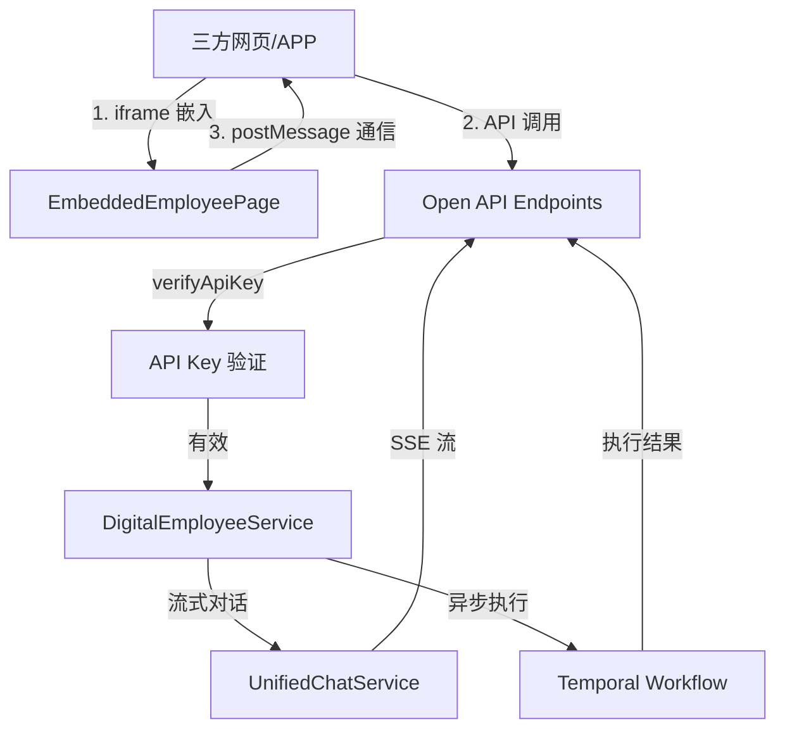

## 产品概述

复用现有应用级 API Key（应用密钥）机制，实现数字员工可以方便地集成到任意三方网页或 APP 中。用户可通过 API 调用数字员工能力，也可通过 UI 嵌入方式将完整的数字员工界面（AgentDock + Assistant）嵌入到第三方系统中。

## 核心功能

### 1. 数字员工 Open API

- 复用现有 `verifyApiKey` 中间件验证应用密钥
- 新增流式对话端点 `POST /api/v1/open/apps/:appId/employees/:employeeId/chat`，返回 SSE 流
- 新增异步执行端点 `POST /api/v1/open/apps/:appId/employees/:employeeId/execute`，返回 executionId
- 支持 Bearer Token 和 x-api-key 头认证方式

### 2. 数字员工 UI 嵌入页面

- 新增独立嵌入页面 `/embed/employee/:appId/:employeeId`，无需完整 App 布局
- 渲染完整的 AgentDock（贴边悬浮工具栏）+ AgentWorkspace（协同工作区）
- 支持通过 URL 参数传递 API Key（`?key=<API_KEY>` 或 `?apiKey=<API_KEY>`）
- 支持 iframe 嵌入方式
- 支持与父页面通过 postMessage 通信

### 3. DeveloperPage 集成文档增强

- 在现有 DeveloperPage 新增"数字员工集成"文档区域
- 自动生成 API 调用示例代码（curl、fetch）
- 自动生成 UI 嵌入代码示例（iframe）
- 提供参考的父子页面通信示例代码

### 4. 安全性与限制

- 复用现有 API Key 机制，自动继承密钥的启用/吊销状态
- 更新 `lastUsedAt` 字段，便于监控 API Key 使用情况
- 后端已通过 CORS 配置支持跨域请求（现有配置已允许配置的来源）

## 技术栈

- 后端：Node.js + Express.js（复用现有架构）
- 前端：React + Ant Design + i18next
- SSE 流式传输：Server-Sent Events
- 跨域通信：postMessage API

## 实现方案

### 1. 后端新增 Open API 端点

**修改文件**：`server/routes/openApi.routes.js`

- 新增两条路由，复用现有 `verifyApiKey` 中间件
- 路由挂载在已有的 `/api/v1/open` 路径下

**修改文件**：`server/controllers/openApi.controller.js`

- 新增 `streamEmployeeChat` 控制器方法
- 从 URL 参数获取 `appId`、`employeeId`
- 从请求体获取 `message`、`sessionId` 等参数
- 构造 `writer` 对象适配 `UnifiedChatService` 的 SSE 写入接口
- 调用 `digitalEmployeeService.streamEmployeeChat(writer, {...})` 实现流式对话
- 设置正确的 SSE 响应头（`Content-Type: text/event-stream`）
- 新增 `executeEmployee` 控制器方法
- 调用 `digitalEmployeeService.executeEmployee(employeeId, triggerData)` 实现异步执行
- 返回 `{ executionId, workflowId, employeeId }`

**SSE writer 适配关键代码**：

```javascript
const sseWriter = {
  write: (type, data) => {
    res.write(`data: ${JSON.stringify({ type, ...data })}\n\n`);
  },
  end: () => {
    res.write('data: [DONE]\n\n');
    res.end();
  },
  flush: () => { if (res.flush) res.flush(); }
};
```

### 2. 前端新增嵌入页面

**新建文件**：`client/src/pages/embed/EmbeddedEmployeePage.jsx`

- 独立的 React 页面组件，不包含 App 主布局（无侧边栏、无顶部导航）
- 接收 URL 参数：`:appId`、`:employeeId`、`?key=<API_KEY>` 或 `?apiKey=<API_KEY>`
- 使用 `AgentDockProvider` 包裹，提供 `AgentDock` + `AgentWorkspace`
- 通过 postMessage 与父页面通信：
- 发送消息：`window.parent.postMessage({ type: 'employee-ready', employeeId }, '*')`
- 接收消息：`window.addEventListener('message', callback)` 处理父页面发来的消息

**修改文件**：`client/src/App.jsx`

- 新增路由：`/embed/employee/:appId/:employeeId`
- 该路由不需要 `ProtectedRoute` 保护（嵌入场景可能无登录态）
- 使用 `React.lazy` 懒加载嵌入页面组件

### 3. DeveloperPage 增强

**修改文件**：`client/src/pages/app-settings/DeveloperPage.jsx`

- 新增"数字员工集成"文档区域（参考现有 `ExternalApiIntegration` 的实现模式）
- 生成内容：

1. API 调用示例（curl、JavaScript fetch）
2. UI 嵌入代码示例（iframe）
3. postMessage 通信示例

- 使用 `XMarkdownDisplay` 渲染 Markdown 文档（复用现有组件）

### 4. CORS 配置

**文件**：`server/index.js`

- 现有 CORS 配置已通过 `CLIENT_ORIGINS` 环境变量控制
- 嵌入场景可能需要允许更多来源，建议：
- 保持现有配置方式不变
- 或在生产环境通过 Nginx 层处理 CORS

## 架构设计

### 系统架构图



### 数据流

**API 调用流程**：

1. 三方系统携带 API Key 调用 `POST /api/v1/open/apps/:appId/employees/:employeeId/chat`
2. `verifyApiKey` 中间件验证 Key 有效性
3. 控制器调用 `digitalEmployeeService.streamEmployeeChat()`
4. 返回 SSE 格式的流式响应

**UI 嵌入流程**：

1. 三方网页通过 iframe 加载 `/embed/employee/:appId/:employeeId?key=<API_KEY>`
2. 嵌入页面渲染 AgentDock + AgentWorkspace
3. 用户与数字员工交互
4. （可选）通过 postMessage 与父页面通信

## 目录结构

### 新增/修改文件列表

```
server/
├── routes/
│   └── openApi.routes.js          [MODIFY] 新增数字员工 Open API 路由
├── controllers/
│   └── openApi.controller.js       [MODIFY] 新增 streamEmployeeChat、executeEmployee 方法
└── index.js                        [MODIFY] 确认 CORS 配置允许嵌入场景

client/src/
├── pages/
│   └── embed/
│       └── EmbeddedEmployeePage.jsx  [NEW] 数字员工嵌入页面
├── App.jsx                         [MODIFY] 新增嵌入页面路由
└── pages/
    └── app-settings/
        └── DeveloperPage.jsx        [MODIFY] 新增数字员工集成文档区域
```

## 设计风格

采用与现代 Web 应用一致的简洁专业风格，确保嵌入到第三方系统时的视觉融合度。

## 嵌入页面设计

### 页面布局

- 无传统 App 布局（无侧边栏、无顶部导航栏）
- 全屏展示数字员工界面
- 左侧/贴边显示 AgentDock 工具栏
- 右侧/底部显示 AgentWorkspace 协同工作区

### 嵌入模式

1. **iframe 模式**：第三方通过 iframe 嵌入，页面自适应 iframe 尺寸
2. **独立页面模式**：可直接访问，作为独立的数字员工对话界面

### 交互设计

- AgentDock 悬浮在页面右侧边缘
- 点击 Dock 头像展开 AgentWorkspace